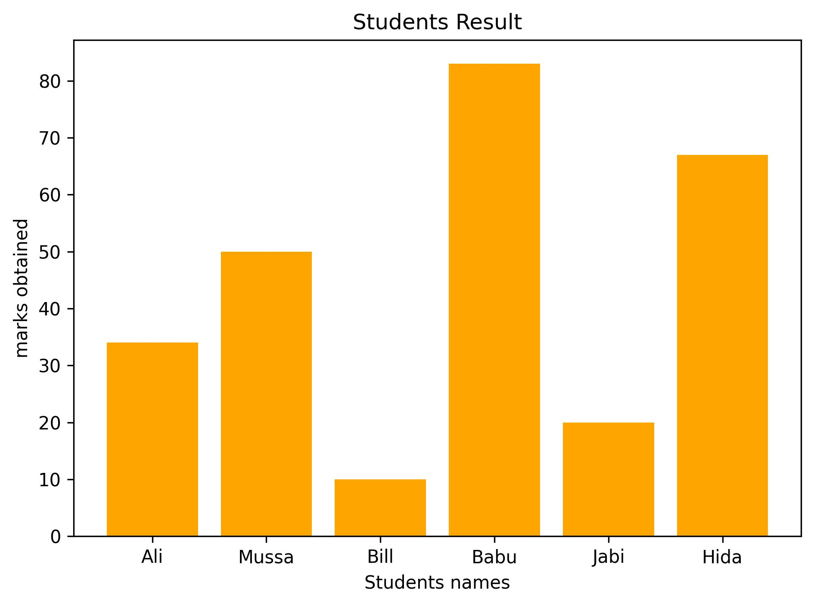
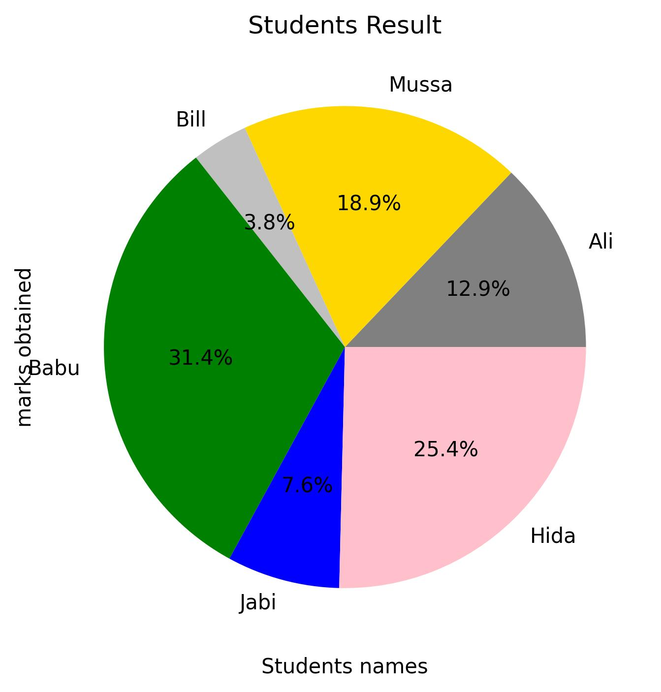
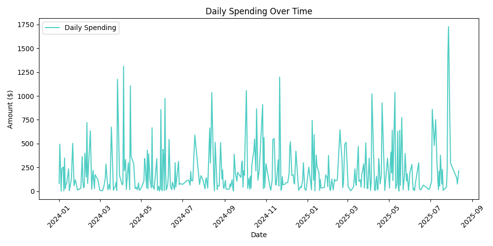

# 📊 Python Data Visualization Toolkit


A beginner-friendly collection of Python scripts demonstrating **data visualization techniques** with [Matplotlib](https://matplotlib.org/), [Pandas](https://pandas.pydata.org/), and [NumPy](https://numpy.org/).  
From simple line charts to advanced customized plots — this repository is perfect for learners and practitioners who want to present their data beautifully.

---

## 🚀 Features

- **Bar Charts** – Compare categories visually.
- **Pie Charts** – Show proportions with custom colors and labels.
- **Histograms** – Explore frequency distributions.
- **Scatter Plots** – Identify correlations and trends.
- **Subplots** – Display multiple graphs in one figure.
- **Styling Options** – Colors, markers, legends, grids, DPI control.
- **CSV Data Integration** – Real datasets like `expenses_500_rows.csv`.

---

## 📂 Project Structure

```
Data Visualization/
│── adjustment.py         # Plot adjustments & formatting
│── Barchat.py            # Bar chart examples
│── Basic.py              # Introduction to pyplot
│── Detailing.py          # Adding legends, grids, and labels
│── example.py            # Sample visualizations
│── Histogram.py          # Frequency histogram examples
│── piechart.py           # Pie chart demonstrations
│── Project.py            # Combined visualization script
│── pyplot.py             # Pyplot essentials
│── savingfile.py         # Export plots to images
│── Scatterplot.py        # Scatter plot examples
│── subplot.py            # Multiple visualizations
│── expenses_500_rows.csv # Example dataset
│── *.jpg / *.png         # Visualization output samples
```

---

## 📜 Installation

1. **Clone the repository**
   ```bash
   git clone https://github.com/developerZohab/data-visualization.git
   cd data-visualization
   ```

2. **Install dependencies**
   ```bash
   pip install matplotlib pandas
   ```

---

## ▶ Usage

Run any script to generate its respective chart.  
Example:
```bash
python Barchat.py
```
The chart will appear in a new window, and some scripts will save `.jpg`/`.png` files in the project folder.

---

## 📘 Concepts Covered

- `pyplot` basics – `plt.plot`, `plt.show`
- Data points, X/Y axes, and figures
- Labels, markers, line styles, and colors
- Legends, grids, and customization parameters
- **Object-Oriented API** in Matplotlib
- DPI (dots per inch) for high-resolution charts

---

## 🖼 Example Outputs

| Visualization Type | Example |
|--------------------|---------|
| Bar Chart          |  |
| Pie Chart          |  |
| Category Pie Chart |  |

---

## 📜 License
This project is licensed under the [MIT License](LICENSE).

---

## 👨‍💻 Author
**[Developer Zohab](https://github.com/developerZohab)**  
Passionate about turning data into visually appealing insights.  
📧 zohabalam845@gmail.com

